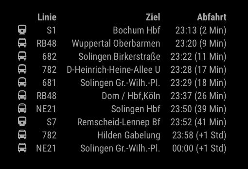

# MMM-Vrr

This is a module for the [MagicMirror²](https://github.com/MichMich/MagicMirror/).

Displays the next departure times of Trains, subway and Busses from any city and station in the german federal state North Rhine-Westphalia



## Installation

1. Navigate into your MagicMirror's `modules` folder.
1. Execute `git clone https://github.com/Klizzy/MMM-Vrr.git`.
1. Execute `cd MMM-Vrr`.
1. Execute `npm install`.

## Using the module

To use this module, add the following configuration block to the modules array in the `config/config.js` file:
```js
var config = {
    modules: [
        {
            module: 'MMM-Vrr',
            position: "top_right",
            config: {
                city: 'Düsseldorf',
                station: 'Hauptbahnhof',
                numberOfResults: 10,
                updateInterval: 60000,
                displayIcons: true,
                displayTimeOption: 'countdown'
            }
        }
    ]
}
```
## Configuration options

| Option           | Description | Options |
|----------------- |---|---
| `city`           | *Required* German City Name `String` (**default**: Düsseldorf) | Any City Name in North Rhine-Westphalia
| `station`        | *Required* German Station Name `String` (**default**: Hauptbahnhof) | Any Station Name in North Rhine-Westphalia
| `numberOfResults`| *Optional* Number of results to be displayed `Int` (**default**: 10) | *
| `displayIcons`   | *Optional* Display fontawsome icons `boolean` (**default**: true) | false
| `updateInterval` | *Optional* Sets the Update Interval int <br><br>**Type:** `int`(milliseconds) <br>Default 60000 milliseconds (1 minute) | * (API result is always cached for 1 Min)
| `displayTimeOption` | *Optional* Option to change the departure time `String` (**default**: 'countdown') | 'time', 'time+countdown', 'countdown'

## Supported Languages

Currently only `de` and `en`. Gets the Value from the Global Magic Mirror language config 