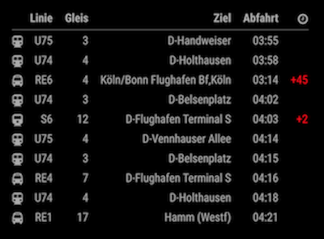
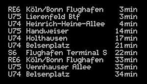
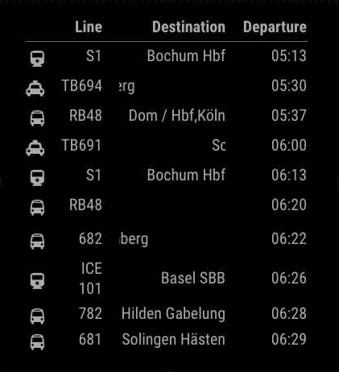

# MMM-Vrr and more areas


This is a module for the [MagicMirror²](https://github.com/MichMich/MagicMirror/).

Displays the next departure times of Trains, subway and Buses from any city and station in the german federal state North Rhine-Westphalia (VRR).

This module was intended for VRR, but it also supports the [following](#efa) Areas.

If you like this module, consider to give this project a :star: on GitHub to show support.

 &nbsp;&nbsp; 

## Installation

1. Navigate into your MagicMirror's `modules` folder.
1. Execute `git clone https://github.com/Klizzy/MMM-Vrr.git`.
1. Execute `cd MMM-Vrr`.
1. Execute `npm install`.

## Using the module

To use this module, add the following configuration block to the modules array in the `config/config.js` file:

```
{
    module: 'MMM-Vrr',
    position: "top_right",
    config: {
        city: 'Düsseldorf',
        station: 'Hauptbahnhof',
        numberOfResults: 10,
        displayTimeOption: 'countdown',
        displayType: 'detail'
    }
}
```

## Configuration options

<div style="text-align: center;">

| Option               | Description                                                                                                                                                                                   | Options                                                         | LCD type support |
| -------------------- | --------------------------------------------------------------------------------------------------------------------------------------------------------------------------------------------- | --------------------------------------------------------------- | ---------------- |
| `city`               | _Required_ German City Name <br><br>**Type:** `String` (**default**: Düsseldorf)                                                                                                              | Any City Name in North Rhine-Westphalia                         | ✅               |
| `station`            | _Required_ German Station Name <br><br>**Type:** `String` (**default**: Hauptbahnhof)                                                                                                         | Any Station Name in North Rhine-Westphalia                      | ✅               |
| `numberOfResults`    | _Optional_ Number of results to be displayed <br><br>**Type:** `Int` (**default**: 10)                                                                                                        | \*                                                              | ✅               |
| `displayType`        | _Optional_ Changes the display type <br><br>**Type:** `String` (**default**: 'detail')                                                                                                        | `'detail'`, `'lcd'`                                             | ✅               |
| `displayIcons`       | _Optional_ Display fontawsome icons <br><br>**Type:** `boolean` (**default**: true)                                                                                                           | `false`                                                         | ❌               |
| `updateInterval`     | _Optional_ Sets the Update Interval int <br><br>**Type:** `int`(milliseconds) <br> **Default** 60000 milliseconds (1 minute)                                                                  | \* (API result is always cached for 1 Min)                      | ✅               |
| `displayTimeOption`  | _Optional_ Changes the type of time <br><br>**Type:** `String` (**default**: 'countdown')                                                                                                     | `'time'`, `'time+countdown'`, `'countdown'`                     | ❌               |
| `setWidth`           | _Optional_ Sets the width of the module in pixel <br><br>**Type:** `int` (**default**: false)                                                                                                 | Any posible size like: `450`                                    | ❌               |
| `lcdWidth`           | _Optional_ Sets the width of the lcd display type <br><br>**Type:** `int` (**default**: 450)                                                                                                  | any possible size                                               | ✅               |
| `scrollAfter`        | _Optional_ Scrolls the destination text after the specified characters <br><br>**Type:** `int` (**default**: false)                                                                           | any possible size or `false`                                    | ❌               |
| `withoutDestination` | _Optional_ Only show results without destination. Supports a list of strings, separated by comma (","). <br><br>**Type:** `list of strings` (**default**: empty list (show all destinations)) | any possible list (e.g., ["Aachen, Hbf,Aachen","Duisburg Hbf"]) | ❌               |
| `platform`           | _Optional_ Only show platform. Supports multiple strings, separated by comma (","). <br><br>**Type:** `string` (**default**: empty (show all platforms))                                      | any possible string (e.g., "2,3")                               | ✅               |
| `line`               | _Optional_ Only show lines that start with the given string. Supports multiple strings, separated by comma (","). <br><br>**Type:** `string` (**default**: empty (i.e., show all lines))      | any possible string (e.g., "RB33,U")                            | ✅               |

</div>

## Support

If you like my module and want to thank, you could consider:

- buying Buy me a :coffee: & plant a 🌳 at the same time
- give this Project a :star: on GitHub.

<a href="https://www.buymeacoffee.com/klizzy" target="_blank"></a>

## Supported Languages

Currently only `de` and `en` is supported. Gets the Value from the Global Magic Mirror language config.

## "LCD" Display

This view can be set if `displayType: 'lcd'` has been set.

**Not all config parameters are supported in this mode. Check the parameters within the "Configuration options" table.**

</br>

## Visualization of the scrollAfter option

If you set `scrollAfter:15`, the text will be scrolled horizontally if it has 15 or more characters.



## <a name="efa"></a> EFA Support for other Areas

**Please keep in mind, that everything besides VRR is not full supported.**
You can check your station and city combination beforehand [here](https://github.com/Klizzy/MMM-Vrr#-check-if-your-station-is-supported)

Possible Side effects for not VRR Areas:

- Icons don't match correctly
- not all configured transport types hide correctly

**Partly supported Areas:**

- ASEAG
- BSVG
- DING
- IVB
- KVV
- LinzAG
- NVBW
- SVV
- TLEM
- VBL
- VGN
- VMV
- VOR
- VRN
- VVO
- VVS
- VVV
- BVG
- DB
- NAHSH
- NASA
- NVV
- RSAG
- SBB
- VBB
- VBN
- ÖBB

## <a name="check"></a> Check if your station is supported

This application uses the provided API from [vrrf.finalrewind.org](https://vrrf.finalrewind.org). If your desired station and city combination returns a result, its highly possible that MMM-Vrr supoorts it also

## Feedback

It's my first Open Source Project, so it would be nice if you share your experience with this module with me <a href="mailto:steven.zemelka@gmail.com">steven.zemelka@gmail.com</a>!
Feel free to suggest additional features and / or improvements.

## Changelog

See [changelogs.md](https://github.com/Klizzy/MMM-Vrr/blob/master/changelogs.md) to view changes and contributors.
